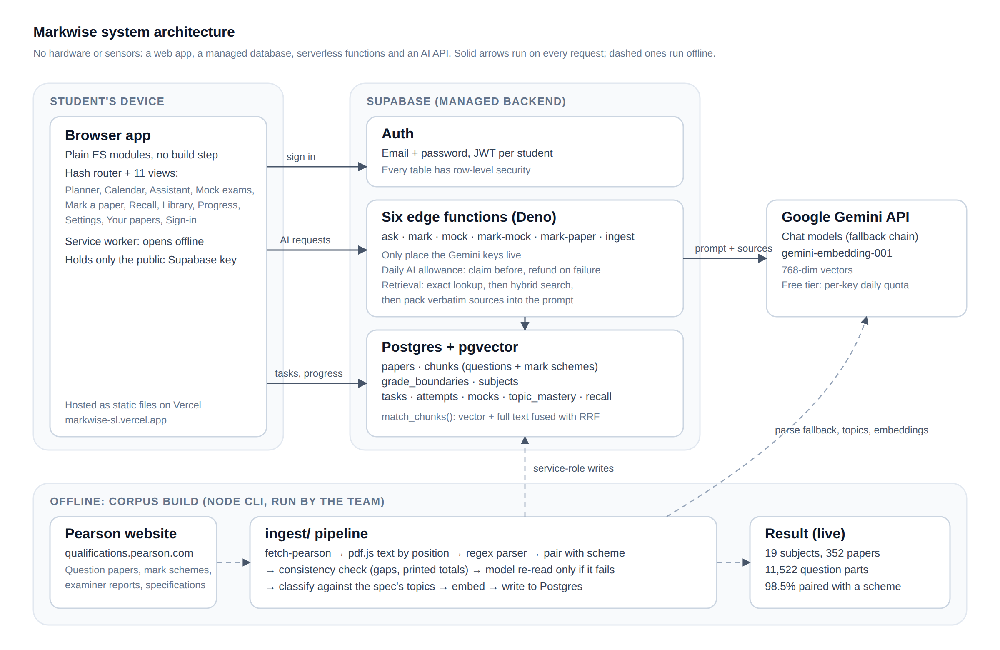

# Markwise

**A study app for Pearson Edexcel International GCSE that has actually read the papers.**

Live at [markwise-sl.vercel.app](https://markwise-sl.vercel.app/).

Markwise does two jobs. It keeps track of homework, assessments, tuition and revision. And it
answers questions, marks answers and builds mock exams from **11,522 real past-paper questions,
their mark schemes, examiner reports and specifications** across 19 Edexcel subjects, instead
of from a chatbot's memory.

We built it because of what happens when you ask a general chatbot to mark a 6-mark Biology
answer. You get a confident breakdown that has never seen the mark scheme: invented mark
allocations, topics that aren't on the syllabus, "examiner tips" nobody wrote. Markwise finds
the real question and the real marking points first, and every answer names the paper and
question it came from so you can check it.

If you're assessing the project, start with [docs/submission](docs/submission/README.md). The
development story is in [docs/development.md](docs/development.md).

---

## What it does

| Screen | What you get |
|---|---|
| **Planner** | Homework, assessments and revision by subject, across school, tuition and your own study. A "due for revision" list worked out from the marks you've actually lost. |
| **Calendar** | The month shaded by workload in minutes, this week's tuition, and a countdown to your exam series. |
| **Assistant** | One chat box. Ask a question and get an answer built from real papers, with citations you can open. Paste an answer with a question reference and it's marked point by point against the real scheme. |
| **Mock exams** | A paper assembled from real questions, weighted towards your weak topics, sat under a timer, marked in one request, with a predicted 9-1 grade where boundaries exist. |
| **Mark a paper** | Photograph your written paper. Markwise reads the cover to work out which paper it is, marks every question against its scheme and keeps the result. |
| **Recall** | Flashcards made of short real questions and their real schemes, on a spaced-repetition schedule. Costs no AI allowance. |
| **Library** | The corpus itself: search it, filter by topic or paper, and read any question with its scheme and examiner comments. |
| **Progress** | Topic mastery, weak topics, a weekly trend and readiness, built only from answers marked against real schemes. |
| **Your papers** | For whoever runs the deployment: add past papers from the browser. |

Keyboard: `P` planner, `C` calendar, `A` assistant, `M` mocks, `K` mark a paper, `R` recall,
`L` library, `G` progress. In Recall, space reveals the answer and `1`-`4` rates it.

---

## How it works



- **Browser:** plain ES modules, no build step, hosted as static files on Vercel. It only ever
  holds the public Supabase key.
- **Supabase:** Postgres with row-level security on every user table, pgvector for embeddings,
  and `match_chunks()`, which fuses vector and full-text search with reciprocal rank fusion.
- **Six edge functions** (`ask`, `mark`, `mock`, `mark-mock`, `mark-paper`, `ingest`) are the
  only place the Gemini keys live. Each one claims a unit of the student's daily AI allowance
  before calling the model and refunds it if the call fails.
- **The corpus** is built offline by a Node CLI in `ingest/`: it downloads PDFs from Pearson's
  site, reads text by its position on the page, parses questions and mark schemes with
  regexes, pairs them, and only asks the model to re-read a paper when the parse doesn't add up.

A few decisions that shaped the rest:

- **Exact lookup before similarity.** "4PH1 June 2024 Paper 1P Q4(b)" is resolved directly in
  SQL. Vector search is bad at identifiers; keyword search is bad at "why does the parachute
  slow down". Hybrid search covers the in-between.
- **The mark scheme lives on the question's row**, so one hit answers both "what was asked"
  and "what earns the marks".
- **The model never writes mock questions.** It returns an order of question ids, and the
  server copies each question verbatim from the database.
- **A doubtful pairing stays unpaired.** Marking an answer against the wrong scheme is the
  worst thing this app could do, so the pairing code refuses to guess.
- **Recall ratings stay out of mastery.** "I knew that" isn't a mark.

---

## Running it

Full instructions are in [SETUP.md](SETUP.md). In short:

1. **Database:** `supabase db push` (or run `supabase/migrations/` in order; see
   [docs/MIGRATIONS.md](docs/MIGRATIONS.md)).
2. **Edge functions:** `supabase functions deploy ask mark mock mark-mock mark-paper ingest`,
   then set `GEMINI_API_KEYS` as a function secret.
3. **Frontend:** point `src/js/config.js` at your project (or set `window.MARKWISE_CONFIG`)
   and serve the folder. `npm run build` makes the Vercel bundle in `dist/`.
4. **Corpus:** load papers with the CLI (below), or one at a time as an admin under
   Settings, Your papers. Without a corpus, the planner and calendar still work and the AI
   screens say plainly that they have nothing to answer from.

### Building the corpus

```bash
cd ingest && npm install && cp .env.example .env   # service-role key + Gemini keys

node fetch-pearson.mjs --subjects 4PH1 --years 2021-2025         # Pearson's own site only
node ingest.js syllabus --file ./pdfs/4PH1/E-4PH1_y17_sy.pdf     # spec first: it sets the topics
node ingest.js papers --dir ./pdfs/4PH1 --subject E-4PH1
node ingest.js boundaries --file <Pearson grade-boundary pdf> --year 2024 --session Jun
node ingest.js classify | reembed | status
```

File naming and troubleshooting are in [docs/PAPERS.md](docs/PAPERS.md). Read-only audit and
evaluation tools live in `ingest/tools/`.

---

## Layout

```
index.html  manifest.webmanifest  sw.js   app shell, installable, opens offline
src/css/        app.css, chat.css, workspace.css
src/js/         app.js (bootstrap), router.js, store.js, config.js, theme.js
  api/          client.js (Supabase + SSE), data.js (every table), ai.js (AI routes)
  lib/          dates.js, exam.js (labels), routing.js (what a message wants), offline.js
  ui/           dom.js (escaping, markdown), feedback.js (modals, toasts)
  views/        one file per screen
supabase/
  migrations/   schema history, oldest first
  functions/    the six edge functions and _shared/ (gemini, retrieve, prompts, quota...)
  tests/        schema_contract.sql
ingest/
  ingest.js, fetch-pearson.mjs, lib/   the corpus pipeline
  tools/        audits, evaluations, corpus report, Pearson research scripts
  smoke-*.mjs, check-assistant.mjs, rag-proof.mjs   live tests
scripts/build-static.mjs                Vercel build
test/                                   offline tests
docs/                                   development history, papers guide, submission evidence
```

---

## Tests

```bash
npm test          # 239 logic assertions + 31 Node tests, no network
npm run check     # every browser module and edge function parses
npm run test:security | test:browser | test:functions | test:assistant | test:upload
```

The `test:*` suites hit a live deployment with throwaway accounts they delete afterwards. CI
runs the offline tests, a syntax check of the CLI and a Deno type-check of the edge functions
on every push. Latest results are in [docs/submission/testing.md](docs/submission/testing.md).

---

## Copyright

Past papers, mark schemes, examiner reports and specifications are © Pearson Education
Limited. `fetch-pearson.mjs` only downloads from `qualifications.pearson.com`, slowly, and
never fetches anything behind a teacher login or still inside Pearson's 12-month embargo. Only
load material you're licensed to use, and keep a deployment private to you or your school.
The code is MIT licensed; see [LICENSE](LICENSE).
