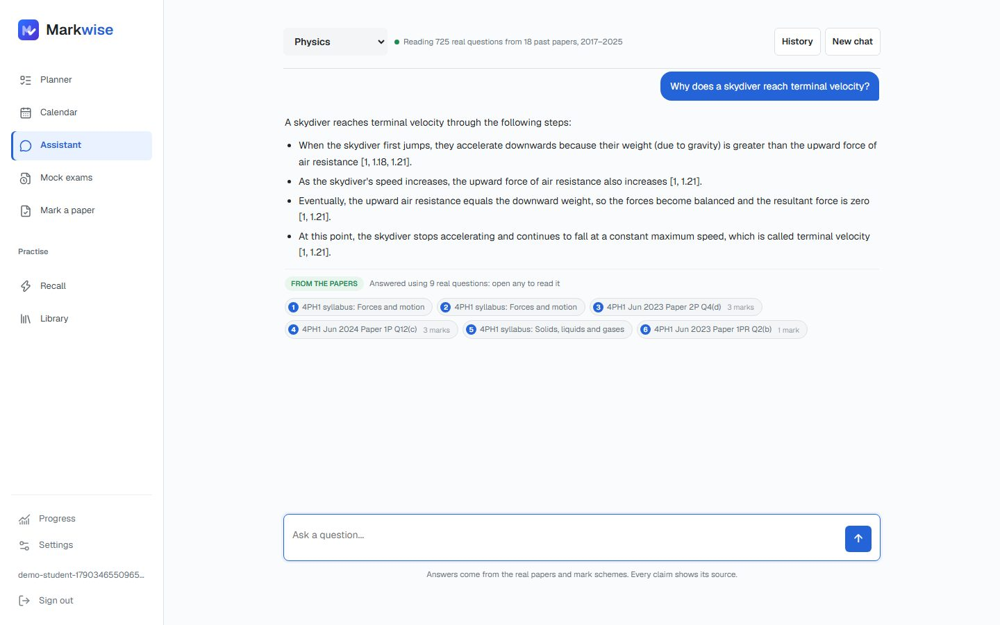
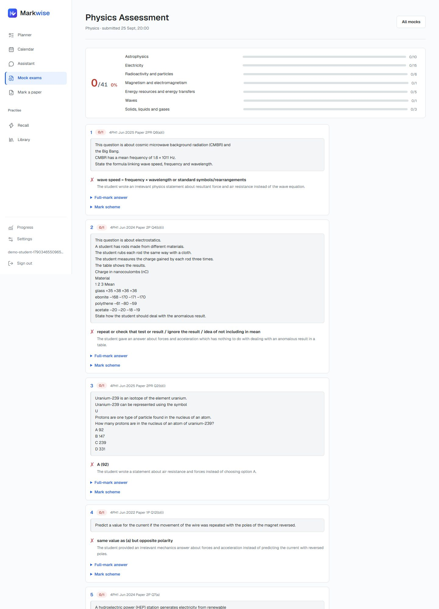
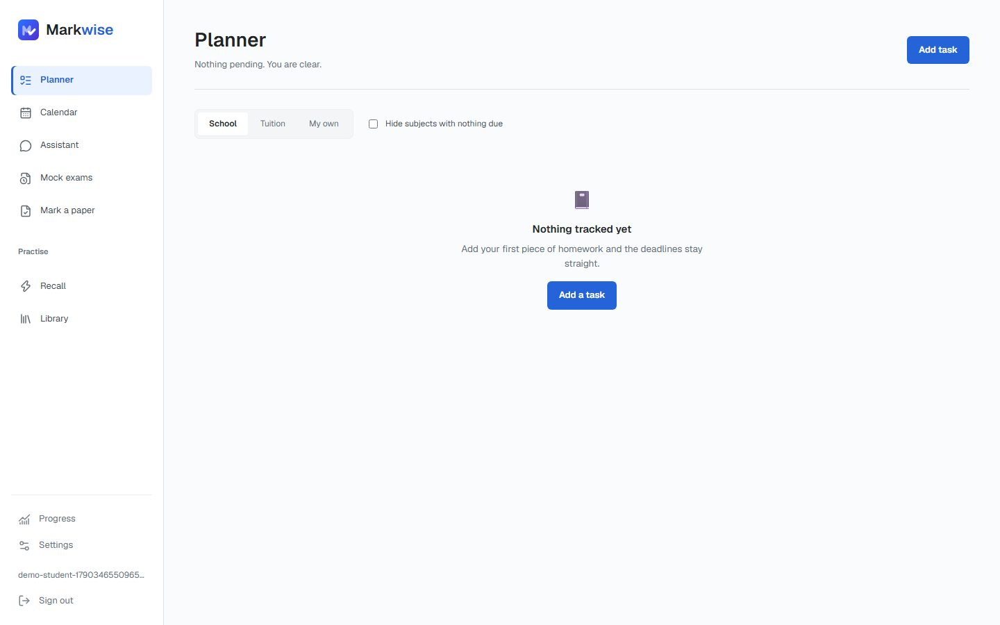
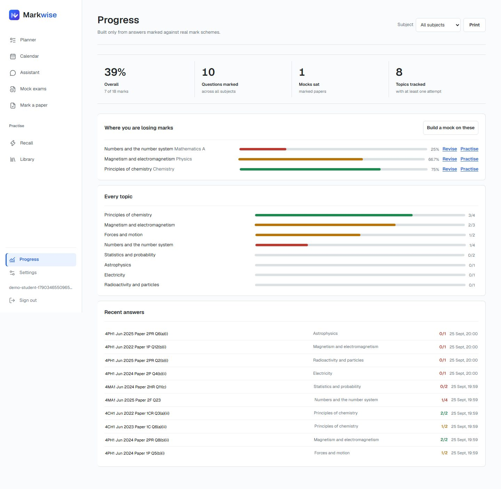

# Submission evidence: Markwise

Markwise is a study app for Pearson Edexcel International GCSE students. It's a homework
planner with an AI assistant, mock-exam generator and answer marker. Every answer comes from
real past papers, mark schemes and examiner reports: 11,522 question parts across 19 subjects,
June 2021 to June 2025.

Live app: https://markwise-tau.vercel.app (private deployment; sign-up needed)

Everything below was generated from the real system on 25 September 2026 unless a file says
otherwise.

## Where each piece of evidence is

| Requirement | Evidence |
|---|---|
| Photographs of user research, planning and key development stages | [development.md](../development.md) (the stage-by-stage record), [screenshots/stages](screenshots/stages) (each stage checked out from git and run), [user-research.md](user-research.md) (for the team's own photos and interview notes) |
| Hardware, sensors, components, wiring, system architecture or block diagram | [architecture.md](architecture.md) with [architecture.png](architecture.png). Markwise is software only: no hardware, sensors or wiring |
| Source code or repository, with key logic identified | The repository itself, and [key-logic.md](key-logic.md), which points to the ten pieces of code that matter most, with file and line |
| Data samples, dashboard views, test cases and results | [data/sample-records.json](data/sample-records.json), [screenshots](screenshots) (every screen, desktop and mobile), [testing.md](testing.md) and the raw logs in [data/test-runs](data/test-runs) |
| Dataset and model-performance evidence (AI teams) | [data-and-model.md](data-and-model.md): the dataset, how it's parsed, retrieval accuracy, marking calibration and live assistant checks |
| Photographs of the completed project, and a note on privacy, safety, security, limitations and future improvements | [screenshots](screenshots) and [privacy-safety-security.md](privacy-safety-security.md) |

## The completed app

| | |
|---|---|
|  |  |
| The assistant answers from cited past-paper sources | A mock exam, marked against the real mark schemes |
|  |  |
| The homework planner | Progress by topic, built from marked attempts |

Full set, in the order a student meets them:

| # | Screen |
|---|---|
| 01 | Sign in |
| 02 | Picking subjects on first run |
| 03 | Assistant: a grounded answer with citations |
| 04-05 | Library: searching the corpus, and one question with its mark scheme |
| 06-08 | Mock: choosing, sitting under a timer, marked result |
| 09 | Planner |
| 10 | Calendar |
| 11 | Progress |
| 12 | Mark a paper (upload photos of a handwritten paper) |
| 13 | Settings |
| 14-15 | Recall flashcards, front and back |
| 16-18 | Mobile: assistant, planner, progress |
| theme-* | Dark and light themes at 1440px |

## How the evidence was produced

The screenshots come from `capture-demo`, a script that signs up a throwaway student on the
live app, uses each feature for real (actual marking calls, an actual mock), screenshots it
and deletes the account. The stage screenshots come from checking out four commits into
separate folders and running each version as it was.

The numbers come from scripts in [ingest/tools](../../ingest/tools) that anyone with access
can rerun:

```bash
cd ingest
node tools/corpus-report.mjs          # dataset table
node tools/audit-pdfs.mjs pdfs/4PH1   # parser completeness for one subject
node tools/eval-retrieval.mjs         # retrieval accuracy
node tools/eval-marking.mjs           # marking calibration (uses AI quota)
```
